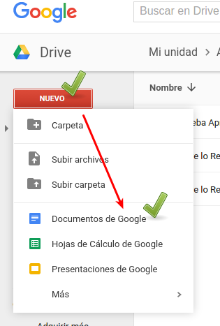
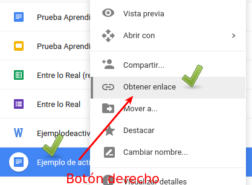
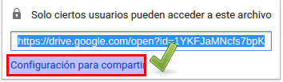
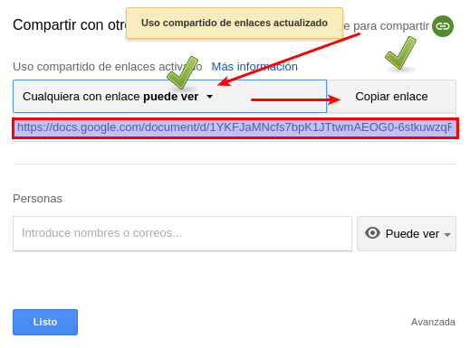
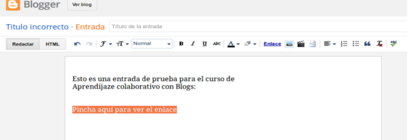
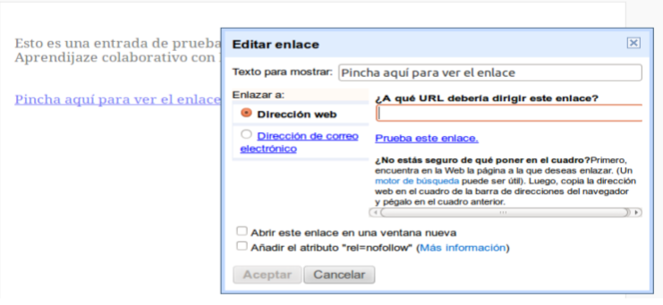

# A través de la nube

## Publicar a través de la nube con Dropbox

Teniendo Dropbox, es muy cómodo crear un enlace a un archivo tuyo, es también una buena opción en tus envios de correos electrónicos en el caso de archivos que no se pueden adjuntar porque son muy pesados.

Para ver cómo se hace [consulta esta página](http://aularagon.catedu.es/materialesaularagon2013/presentaciones/PowerPoint2007/publicar.html)

## Publicar a través de la nube con Drive

En Google Drive, puedes crear un documento, y darle a compartir, entonces obtienes el enlace

Tienes dos opciones, o crear un documento propio de Drive \(Nuevo-Documento\) o subir un archivo local tuyo, por ejemplo un Word

### ¿Cómo queda en Drive las dos opciones?

Pues lo mejor es que lo veas:

* [Aquí tienes un enlace ](https://docs.google.com/document/d/1YKFJaMNcfs7bpK1JTtwmAEOG0-6stkuwzqRVOZQ1qNs/edit?usp=sharing)a un documento alojado en Drive y creado en Drive
* [Aquí tienes un enlace](https://drive.google.com/file/d/0B3FoIk-apny0cnlKSlJOYkotN1E/view?usp=sharing) a un documento alojado en Drive y creado en Word

¿cual es mejor? el que quieras!

### ¿Cómo se obtiene en enlace en Drive para ponerlo en el artículo del blog?

Entras en Drive, en Nuevo y aquí tienes las dos opciones:

* Crear un documento dentro de Drive:  **Nuevo - Documento de Google** \(tal y como pone en la imagen\)
* Subir uno tuyo creado previamente en tu ordenador, por ejemplo con Word:  **Nuevo - Subir archivos**

Una vez creado, lo seleccionamos con el botón derecho **Obtener enlace**

En el siguiente diálogo elegimos **Configuración para compartir**

Y en el siguiente menú nos aseguramos de poner activado **Cualquiera con enlace puede ver**

**Es distinto a cualquier con enlace puede editar **Si damos privilegios de editar, TODOS trabajan en el mismo documento, esto se verá en la [Unidad 2 Drive-Documento](drive_documento.html)

Y ya tenemos el enlace que podemos poner en el artículo del Blog!!

## ¿Y cómo se pone el enlace en el artículo?

Crear una entrada en nuestro blog, escribir el nombre que queremos darle al enlace, seleccionardicho texto y pulsar “enlace”

nos preguntará por la dirección donde el elemento multimedia que queremos enlazar está guardado.

