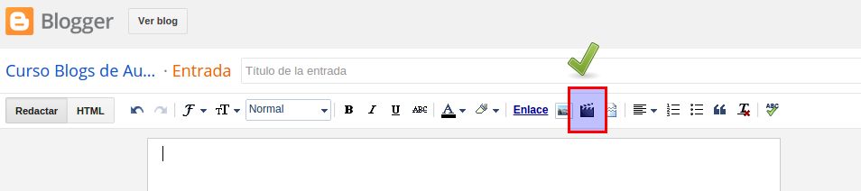
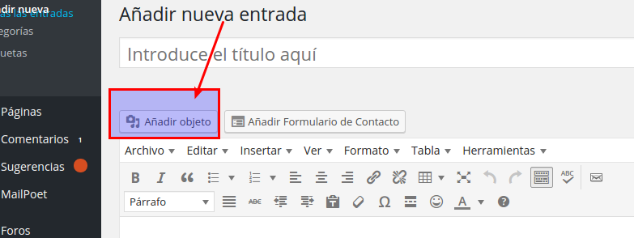
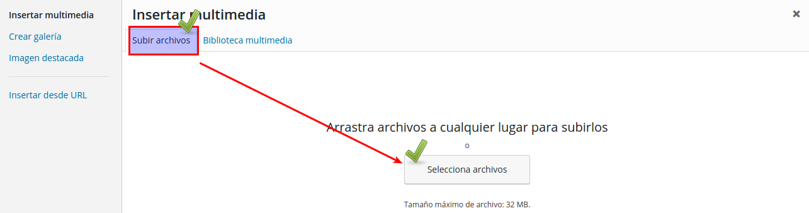
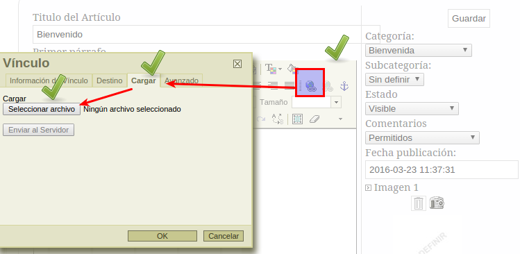

# A través del artículo

## En Blogger

Blogger no permite insertar archivos desde él mismo, es lógico pues Blogger es de Google y si te abres una cuenta en Blogger, tienes cuanta en Google y por lo tanto cuenta en Drive que es el servicio que tiene Google para alojar tus archivos, y puedes poner enlaces a ellos. Es decir, utilizar la técnica de[ A través de la nube ](a_travs_de_la_nube.html)con Drive.

Lo que si permite es subir un archivo de vídeo desde tu ordenador:

## En Wordpress

En una entrada, podemos añadir objetos, en el siguiente botón

Y luego en el siguiente diálogo podemos subir el archivo que queramos:

## En Arablogs

En teoría el editor permite que descarguemos archivos, pero ultimamente (Abril 16) Arablogs está teniendo problemas en el uso de esta opción, además el tamaño máximo permitido en todo tu blog son 5M incluido las imágenes, luego es mejor gastarlas en imágenes. 

Si se te agotan los 5M puedes pedir a CATEDU una ampliación.

