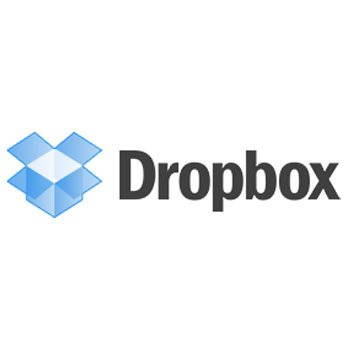
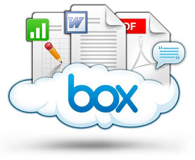

# Almacenamiento de archivos en la nube

Servicios que podemos usar para poner nuestros archivos almacenados en la web y poder compartirlos. Estas plataformas son una buena forma de compartir no solo documentos de textos, sino todo tipo de archivos. Aquí os ofrecemos tres posibilidades.

Para los blogs **RECOMENDAMOS DRIVE**, aunque Dropbox es necesario si vas a utilizar la técnica de [Jotform de Profesor&lt;-Alumno.](profesoralumno2.html)

**DRIVE**

Google Drive es un servicio de almacenamiento de archivos en línea gratuito, en el que además se pueden crear nuevos documentos, editar y compartir los almacenados. Aquí os presentamos un interesante manual de Rosa Garza, incluido en el portal de facilytic, con el que podéis comenzar a trabajar.[Manual ](http://www.catedu.es/facilytic/2013/05/30/manual-google-drive/)

<td style="text-align: center;">Fig. 2.4  Google Drive</td>

 

**DROPBOX**

Este servicio nos permite almacenar y sincronizar diferentes archivos en línea entre ordenadores. Los archivos son sincronizados en la nube, y en todos los ordenadores del usuario, de tal modo que los archivos en la carpeta de esta plataforma pueden ser compartidos con otros usuarios de este servicio.

Este manual, alojado en la web de Julián Trullenque, nos puede servir de guía para trabajar con él, y conocer todas sus peculiaridades. [Manual](http://maestros20.webnode.es/dropbox/)

 Además os añadimos otro práctico tutorial de Javier Quintana, muy interesante. [Tutorial](http://www.catedu.es/facilytic/2013/05/16/dropbox/)

<td style="text-align: center;">Fig. 2.5. Dropbox</td>

 

** BOX**

Es un servicio en Internet para compartir y almacenar archivos. Permitirle compartir archivos o carpetas completas con otros usuarios, incluso con usuarios que no estén suscritos al servicio. 

Para facilitar su uso y manejo, aquí os presentamos dos manuales muy útiles

- [Manual básico de Jose Vicente Alfaro](http://issuu.com/jvalfaro/docs/box)

-[ Manual de uso, de Cesar Martinez, ubicado en el portal facilytic, de CATEDU](http://www.catedu.es/facilytic/2013/10/10/896/)

<td style="text-align: center;">Fig. 2.6. Box</td>

 

Después de ver algunas de sus peculiaridades y características, en este pequeño archivo, podemos apreciar las ventajas e inconvenientes de estas plataformas.
|[Almacenamiento en La Nube-Ventas y Desventajas](http://es.scribd.com/doc/185837897/Almacenamiento-en-La-Nube-Ventas-y-Desventajas) by [DiegoPichon](http://www.scribd.com/DiegoPichon)<iframe id="doc_70836" width="100%" height="600" src="//www.scribd.com/embeds/185837897/content?start_page=1&amp;view_mode=scroll&amp;access_key=key-1q6mwkvjlu190xul6ffl&amp;show_recommendations=true" frameborder="0" scrolling="no"></iframe>
<td style="text-align: center;"> Archivo alojado en Scribd. Fuente: Scribd, Diego Arroyo</td>

 

Como actividad de autoevaluación, la propuesta gira en torno al análisis y reflexión de los servicios que ofrecen almacenamiento en la nube. Seria muy útil e interesante, que probaseis las plataformas que aparecen en el modulo y que atendiendo a unos parámetros que aquí especificamos, os decantarais por vuestra favorita, todo esto sin obviar las aparecidas en el aparatado PARA SABER MAS.

Tales parámetros por los que os podías regir son los siguientes:

- Versatilidad de la plataforma
- Interfaz atractivo
- Funcionalidad para mis objetivos
- Facilidad en el manejo
- Posibilidades de rendimiento educativo

 

