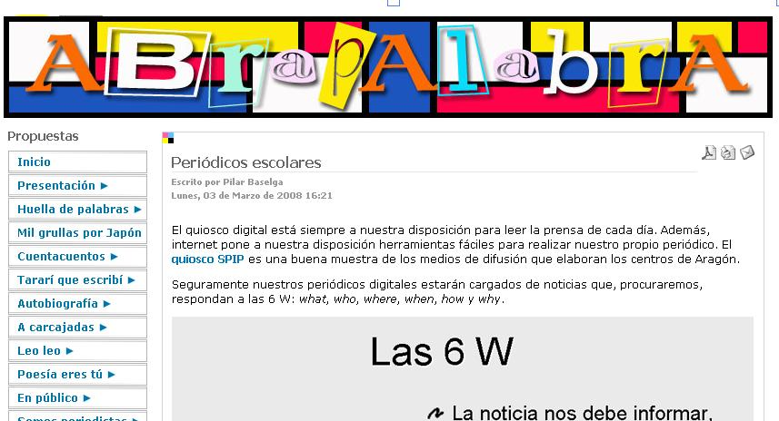
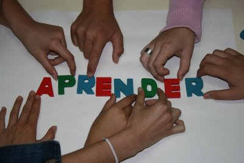

# Ampliación de contenidos

## ParaSaberMas

Herramientas más interactivas

- ¿Por qué no poner una ventana de visitantes que tiene el blog? : [http://feedjit.com/](http://feedjit.com/) es una buena opción. Mira la parte derecha de este [blog](http://arablogs.catedu.es/blog.php?id_blog=1312)
-  ¿Y Twitter quedaría genial? [Como hacerlo en blogger y wordpress](https://lnarueda.wordpress.com/2013/10/07/como-anadir-tu-perfil-de-twitter-a-tu-blog-de-blogger-y-wordpress-actualizado/)

Visitando estos enlaces podéis añadir más información a la ya añadida. Son lecturas muy recomendables,variadas e interesantes acerca de todo lo visto hasta ahora:

 - [periódicos escolares ](http://www.catedu.es/abrapalabra/index.php?option=com_content&amp;view=article&amp;id=192&amp;Itemid=271)

<td style="text-align: center;">Fig. 3.17 Captura de pantalla. Fuente: [http://www.catedu.es/abrapalabra/index.php?option=com_content&amp;view=section&amp;id=15&amp;Itemid=218](http://www.catedu.es/abrapalabra/index.php?option=com_content&amp;view=section&amp;id=15&amp;Itemid=218)</td>

 

Excelente material sobre la mayoría de los aspectos a tener en cuenta a la hora de trabajar con **revistas escola****res**.

- [dinámicas de aprendizaje colaborativo](http://ineverycrea.net/comunidad/ineverycrea/recurso/dinamicas-de-trabajo-colaborativo-en-el-aula/5f4a18cf-4abd-40f1-baeb-69d0a718c196)

<td style="text-align: center;">Fig. 3.18. Fuente:[http://educacionysolidaridad.blogspot.com.es/2012/05/aprendizaje-cooperativo-dinamicas-para.html](http://educacionysolidaridad.blogspot.com.es/2012/05/aprendizaje-cooperativo-dinamicas-para.html)</td>

 

Breve y sintética recopilación de dinámicas para trabajar la colaboración en el aula. 

