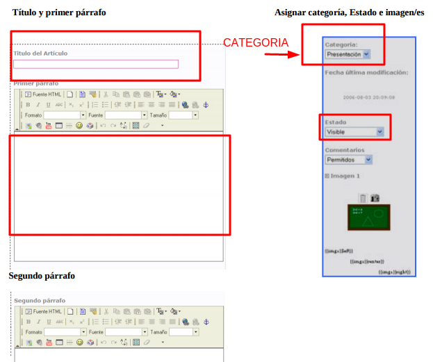

# Arablogs

En este [enlace](http://arablogs.catedu.es/docs/Manual_AraBlogs.pdf) hay un estupendo manual de Arablogs, aunque ahora te recomiendo [este de José Ramón Olalla](http://jr2punto0.blogspot.com.es/2013/11/publicar-en-arablogs.html), más breve para publicar un artículo.

Queremos que te fijes en:

- el campo de **CATEGORÍAS** este campo es necesario rellenarlo en un artículo
- En Arablogs no hay **TAGS**
- El segundo párrafo es el cuerpo que sale si se pincha en"**Leer más...**"

