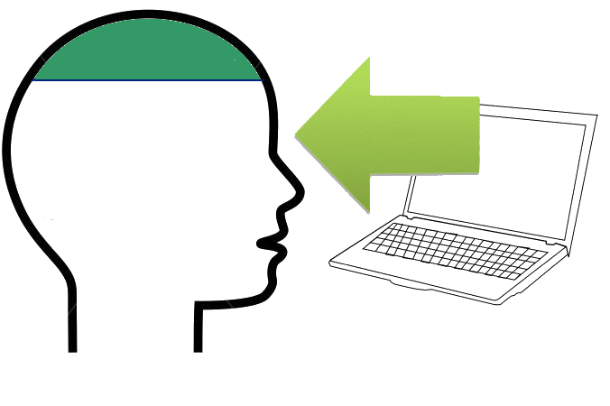

# Contenidos

En este tema nos dedicaremos a dar potencialidad al blog creado en el módulo anterior.

Pero no olvides que aún nos falta más interacción, de momento la información va en un sentido Blog =&gt;Alumno, o Profesor=&gt;Alumno

