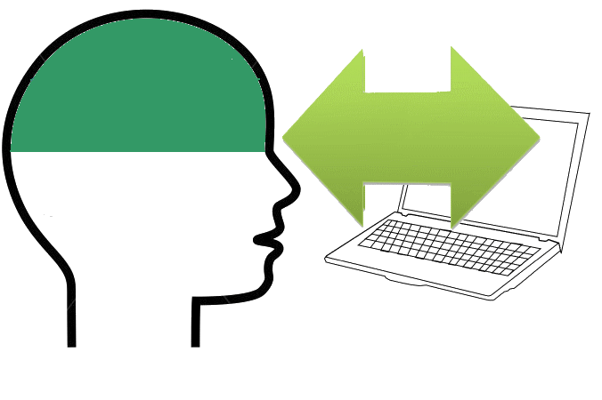

# Contenidos

Ahora buscamos interacción! el alumno en este módulo no se comporta como un sujeto pasivo, sino activo, respondiendo a las actividades que se le propone y creando contenidos con otros compañeros en grupo.

Vamos a trabajar varias actividades que podemos llevar a cabo en el aula, con nuestros/as alumnos/as.

Son actividades que necesitan de la colaboración de unos y otros para realizarlas.

Las actividades propuestas son variadas y muy interesantes.

Lo fundamental del trabajo con estas actividades no son los medios técnicos que utilicemos, ni las herramientas de las que dispongamos, sino nuestra metodología empleada para sacar el mayor rendimiento a nuestros alumnos/as. El trabajo en grupo se fundamenta en:

- responsabilidad individual
- interdependencia positiva
- refuerzos del maestro/a
- interacción personal
- empatía

