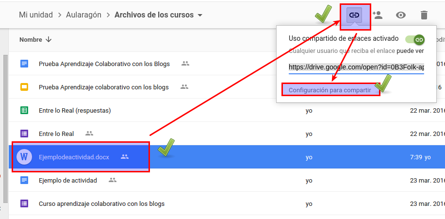
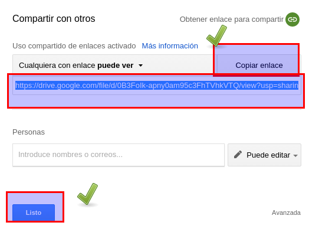

# Drive

En el [módulo 3 aprenderás a embeber un documento colaborativo de Drive](http://aularagon.catedu.es/materialesaularagon2013/blogs/M3_contenido/drive_documento.html). Pero aquí nos vamos a centrar en embeber **uno que no sea propio de Drive,** sino un documento que subes, como un PDF, Word...

1.- Entramos en Drive y seleccionamos un archivo NO DRIVE (por ejemplo en la figura un archivo Word) y le pinchamos a obtener el vínculo-opciones de compartir

2.- Pinchamos en copiar el enlace que nos proporciona

3.- Nos fijamos en el enlace, es de este tipo, remarcamos el identificador del archivo:

https://drive.google.com/file/d/0B3FoIk-apny0am95c3FhTVhkVTQ/view?usp=sharing

4.- Creamos un artículo en el blog, entramos en el html, y pegamos el siguiente código:

**&lt;iframe height="350" src="https://drive.google.com/file/d/0B3FoIk-apny0am95c3FhTVhkVTQ/preview" width="500"&gt;&lt;/iframe&gt;**

El valor de 500 es el ancho y el de 350 el alto, en píxeles, y lo puedes modificar como quieras.

Siempre es aconsejable poner el enlace ([https://drive.google.com/file/d/0B3FoIk-apny0am95c3FhTVhkVTQ/view?usp=sharing](https://drive.google.com/file/d/0B3FoIk-apny0am95c3FhTVhkVTQ/view?usp=sharing)) , junto con el artículo embebido por si se tienen problemas de visualización, pinchando en el enlace se ve más grande.

## ¿Cómo queda?

Pues así:

Pincha en [este enlace](https://drive.google.com/file/d/0B3FoIk-apny0am95c3FhTVhkVTQ/view?usp=sharing) para verlo más grande (el consejo que hemos puesto anteriormente)

<iframe width="500" height="350" src="https://drive.google.com/file/d/0B3FoIk-apny0am95c3FhTVhkVTQ/preview"></iframe>

## No me gusta como queda, queda muy pequeño, ¿Hay alguna manera de que se embeba bien?

Sí pero es más complicado y sólo lo sabemos para Word Press, [aquí tienes cómo se hace](https://github.com/catedu/atrevete-con-wordpress/blob/master/plugins/wordpress-y-google-drive.md)

