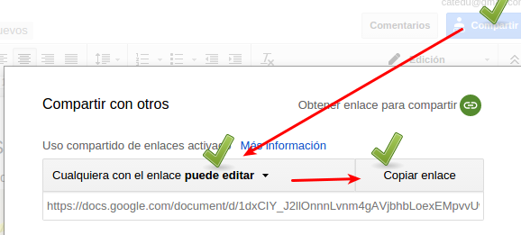
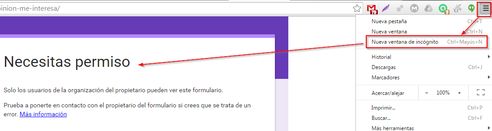
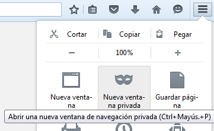

# Drive: Ojo con los permisos

Es muy típico no dar permiso de EDICIÓN :

## Y si esta mal, tú lo ves bien, pero lo otros no

Ves tu blog, y lo ves todo correcto pues estas navegando como usuario registrado de Google ¿cómo lo ven los demás?¿cómo me puedo asegurar que mis documentos se ven bien con los permisos adecuados para que se puedan editar?:

Solución: **ABRE UNA VENTANA EN INCÓGNITO Y MIRA TU BLOG** es tal y como lo ven los demás, si lo ves bien, los demás también

En Chrome con las teclas Ctrl+May+N o pinchando aquí:

Como se puede ver, sale"necesitas permiso" luego no lo has hecho bien.

En Firefox Ctrl+May+P o pinchado aquí:

