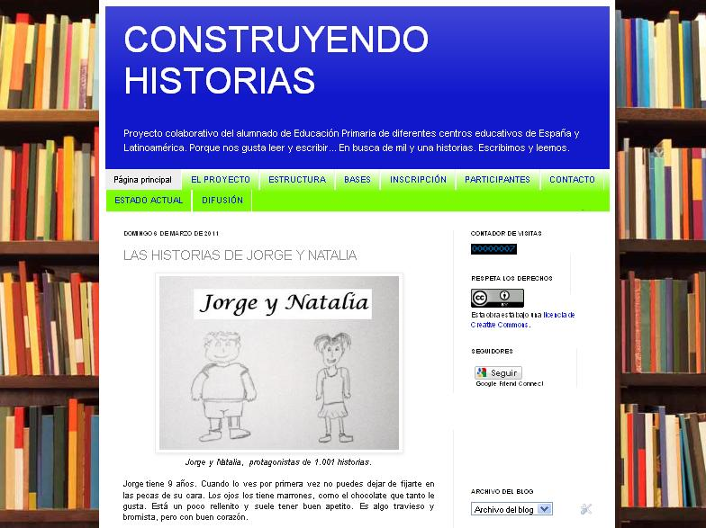

# Evaluación

El conocimiento inicial de los criterios de evaluación es un elemento de carácter motivador y orientador de cualquier actividad, ademas de ser un elemento esencial y muy importante en el desarrollo de cualquier proyecto colaborativo. Incluso la creación de una rúbrica desde el principio; que hasta puede ser negociada, y servirá de apoyo al desarrollo de las tareas.

[Nociones básicas sobre rúbricas.](http://blogs.colombiadigital.net/pre-textos/2011/12/06/las-rubricas-instrumentos-para-valorar-aprendizajes/)

[Ejemplo de rúbricas.](http://www.xtec.cat/~eroyo/webquest/cavaluacio.htm)

Como bien, expone Ana Lopez, en su artículo"La importancia de la evaluación en los proyectos colaborativos", en síntesis, las rúbricas sonbásicamente listas de características que facilitan evaluar la calidad de un producto de aprendizaje determinado. En ellas se identifican los **rasgos** y los **componentes** que deben estar presentes para indicar el nivel que se ha alcanzado en el aprendizaje. En otras palabras, una rúbrica es un conjunto de criterios de evaluación que especifica las características del producto para cada nivel de calidad.

El proceso de evaluación de proyectos colaborativos, pasa por estar organizado desde:

- un aprendizaje en **entornos no estructurados**,
- con** objetivos específicos **pero** flexibles **y** abiertos**,
- que busca la **actividad constante** de lo alumnos,
- que fomenta el **aprendizaje colaborativo** de **docentes** y **alumnos**,
- que apunta el uso de conocimientos a** contextos reales**.

En todo proyecto colaborativo, en el que las TIC son protagonistas, la evaluación debe agrupar al menos estas tres dimensiones o perspectivas evaluativas:

- Evaluación previa: se trata de la evalaución inicial para conocer el grupo (conocimientos previos, nivel de formación, etc).
- Evaluación formativa: se trata de la evaluación que se realiza al finalizar cada tarea de aprendizaje y tiene por objetivo informar de los logros obtenidos.
- Evaluación sumativa: es aquella que pretende constatar si se han logrado los objetivos o condiciones supuestamente deseables en un elemento o situación educativa. Es lo que habitualmente llamamos"evaluación tradicional".

## Actividad

Esta actividad de autoevaluación, pretende ser un ejercicio de reflexión y análisis de un caso practico.

Mediante este blog, ["Construyendo historias"](http://proyectoconstruyendohistorias.blogspot.com.es/), se trata de que identifiquéis todos los elementos necesarios para catalogar a esta experiencia didáctica como proyecto colaborativo. Pensad sobre su proceso de realización, protagonistas, actividades, evaluación, roles de los alumnos/as, recursos&hellip;Identificad lo propuesto en este modulo con esta interesante iniciativa.
