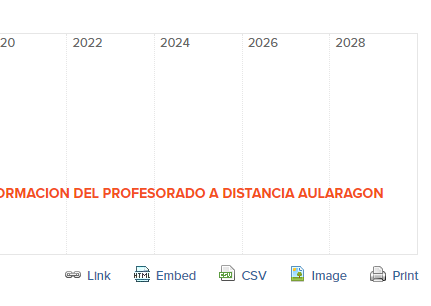

# Líneas del tiempo

## ¿Qué es?

Es una representación de conceptos o eventos que están separados por el tiempo. La representación de la línea de tiempo es con orden cronológico, y tiene el potencial que nos permite las nuevas tecnologías (vídeos, textos, enlaces...)

Hay muchos servicios, pero se están cerrando muchas y cada vez hay menos oferta, [Preceden](http://www.preceden.com/) es otro servicio de líneas de tiempo con el que se pueden hacer cosas como ésta: 

HISTÓRICO CATEDU:

<iframe width="100%" height="320" src="https://www.preceden.com/timelines/316285/embed" frameborder="0">
[Preceden Timeline Maker](https://www.preceden.com)</iframe>El código EMBED esta muy bien señalizado abajo a la derecha:

Como pega es que sólo se puede crear una línea de tiempo por cada correo electrónico, una solución es usar varios correos electrónicos.

Hay [más herramientas de Linea de tiempo aquí ](http://jr2punto0.blogspot.com.es/search/label/l%C3%ADneas%20del%20tiempo)

