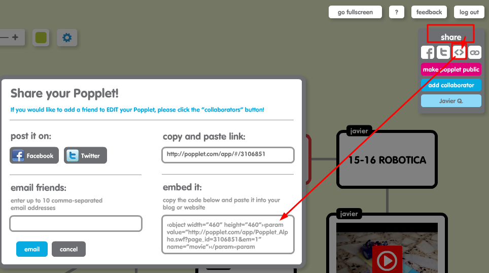

# Mapa mental

## ¿Qué es?

Los mapas mentales son otra forma de representar la información cartografiando las reflexiones acerca de un concepto mediante una estructura orgánica en la que el conocimiento se organiza para conseguir un aprendizaje significativo y activo.  
Los servicios Web 2.0 que permiten construir mapas mentales suelen añadir un valor nuevo e importantísimo para el aula: la colaboración entre iguales a la hora de construir el entramado conceptual, de forma que el resultado final es obra de un equipo coordinado. Por otra parte, la posibilidad de añadir cualquier elemento de la red a la estructura: vídeos, imágenes, enlaces, sonidos, además de textos, convierten a estas representaciones en organismos vivos en los que la multidireccionalidad de nuestro pensamiento queda representada y lista para seguir toda una red de conexiones neuronales. Pincha en [JR Olalla 9/11/13](http://jr2punto0.blogspot.com.es/2013/11/mapas-mentales.html)

## ¿Qué herramientas hay?

Hay muchísimas como gustos: [Popplet](http://popplet.com/) , [Spicesnode](http://www.spicynodes.org/), [Mind42](http://mind42.com/), [Mindomo](https://www.mindomo.com/es/) \(gratis sólo hasta 3 mapas\).  \([Ver artículos JR Olalla](http://jr2punto0.blogspot.com.es/search/label/mapas conceptuales)\). ¿Cuál recomendamos? **MINDOMO** es nuestra favorita

#MINDOMO REGISTRO
Entramos en la web y nos pide registrarnos


Nos pregunta por nuestro perfil, evidentemente **PROFESOR**


y tenemos que proporcionar una cuenta de correo electrónico


Una vez aceptado, nos llegará un correo electrónico donde tenemos que aceptar en el enlace que nos proponen para que esté confirmada nuestra cuenta.

Nuestra cuenta es gratuita pero con limitaciones, y tenemos opciones de pago:


#MINDOMO CREAR MAPA MENTAL

En **CREAR** tenemos muchas opciones, no sólo el mapa mental, sino esquemas, historias, comparativas, debate .... navega por las plantillas y verás las posibilidades didácticas de esta herramienta


La creación es fácil, se puede realizar online o descargar su aplicación, podemos insertar vídeos, enlaces, documentos, imágenes...


#MINDOMO EMBEBERLO EN EL BLOG
Entramos en COMPARTIR arriba a la derecha


Y pulsamos en CAMBIAR y le damos acceso PUBLICO PARA QUE TODO EL MUNDO PUEDA VERLO y nos proporciona el código EMBED para ponerlo en nuestro blog


#MINDOMO COMO QUEDA EMBEBIDO
Pues así

<iframe width="500" height="500" src="https://www.mindomo.com/mindmap/organigrama-dd523cd56fcf42cfbf370b4b57f23079" frameborder="0" allowfullscreen>Your browser does not support frames. <a href="https://www.mindomo.com/mindmap/organigrama-dd523cd56fcf42cfbf370b4b57f23079" target="_blank">View</a> this map on its original site. It was created using <a href="https://www.mindomo.com" target="_blank">Mindomo</a>.</iframe>

---
#Antiguas herramientas de mapa mental
## Ojo que muchos son un flash

¿Y qué? te preguntarás, pues que últimamente los flash tienen mala reputación por los problemas de seguridad, por lo que los navegadores, y ciertos alojadores están empezando a bloquearlos, por ejemplo si haces el blog en wordpress.com no deja embeberlo.

## ¿Entonces qué hago si no puedo embeberlo?

Puedes descargártelo como imagen, y ponerlo en el artículo y por supuesto poner también un vínculo. Abajo tienes ejemplos no embebidos de las mismas herramientas.

Si vas a trabajar sin embeber, una opción es utilizar [http://drichard.org/mindmaps/](http://drichard.org/mindmaps/) que **sin necesidad de registrar**, puedes crear tus mapas mentales, y permite grabarlos en formato imágen, y por lo tanto ponerlos en tu blog.

Hay también herramientas no on-line, sino programas que se instalan, y que por lo tanto descargas el mapa conceptual en forma de imagen y lo pones en el blog, por ejemplo [Freemind](http://freemind.sourceforge.net/wiki/index.php/Main_Page) y [CMapTools](http://cmap.ihmc.us/)

## ¿Cómo queda sin embeber SpicesNode?

Sin embeber, no hemos encontrado exportar como imagen, habría que hacer una captura de pantalla:


Enlace [aquí](http://www.spicynodes.org/a/1063dae41faf762d665f89c47fe64352).

## ¿Cómo se hace?

Manuales hay muchos:

**SpicesNode**

* [Tutorial para aprender a usar Spicynodes](http://www.slideboom.com/presentations/136537), de Viviana Araya.
* [Spicynodes](http://www.slideshare.net/santiav/spicynodes-5874559), un organizador gráfico interactivo

**Popplet**: [Manual ](http://recursostic.educacion.es/observatorio/web/gl/internet/aplicaciones-web/1029-popplet)

\[fuente: [http://www.xarxatic.com/herramientas-2-0/mapas-y-diagramas/](http://www.xarxatic.com/herramientas-2-0/mapas-y-diagramas/)\]

**Bubbl.us **

* Manual de [Bubbl.us](http://www.educacontic.es/va/blog/crea-y-comparte-mapas-conceptuales-con-bubbl-us), de educ@conTIC.
* [Mapas conceptuales sencillos con Bubbl.us](http://www.enlanubetic.com.es/2012/09/mapas-conceptuales-sencillos-con-bubblus.html#.XLb-RugzY2w), de enlanubeTIC.

**Mind42**

* [Cómo crear una cuenta en Mind42](http://www.slideshare.net/ZeroDark/manual-de-min42), de ZeroDark
* [Manual de Mind42](http://es.scribd.com/doc/30862212/Manual-Mind42), de María José Ciudad
* [Tutorial de Mind42](http://es.calameo.com/read/0005765212f065a90f10a), de Jhon Jairo Zapata

**FeeMind**

* [Aprovechamiento pedagógico del software FreeMind](http://www.slideshare.net/edu140271/tutorial-freemind), por Edu Valle
* [Tutorial de FreeMind](https://www.youtube.com/watch?v=jNNgaPyR_Vc&vl=es) \(un poquito largo pero muy completo\).

**CMapTools**

* [Edición de mapas conceptuales: Cmap Tools](http://es.scribd.com/doc/2465505/Edicion-de-mapas-conceptuales-Cmap-Tools), de Aido Velásquez
* [Tutorial de Cmap Tools](http://issuu.com/colegio776/docs/tutorialcmaptools), de Renato Caporale

## ¿Cómo queda sin embeber Popplet?

Pues exportándolo como imagen y se coloca en el artículo con un enlace

Imagen:


## ¿Cómo se hace en Popplet?

Por ejemplo en **Popplet**: se obtiene el código embed así



## ¿Cómo queda embebido en Mind42?

Clica [aquí](http://mind42.com/mindmap/56f17e1d-5ac0-4430-8d0d-0cbad7964cd1). El código embebido funcionará en tu blog. Aquí no se incluye porque da problemas al exportar este libro a pdf.

```html
<iframe width="640" height="480" frameborder="0" src="http://mind42.com/mindmap/56f17e1d-5ac0-4430-8d0d-0cbad7964cd1?rel=embed"></iframe>
```

## ¿Cómo queda sin embeber Mind42?

Imagen


Enlace: [http://mind42.com/public/56f17e1d-5ac0-4430-8d0d-0cbad7964cd1](http://mind42.com/public/56f17e1d-5ac0-4430-8d0d-0cbad7964cd1)

## Sin embeber, Drichard.org


