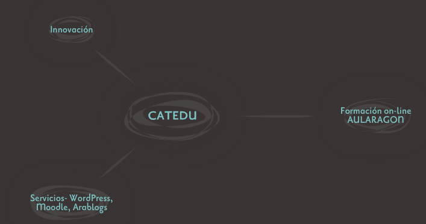
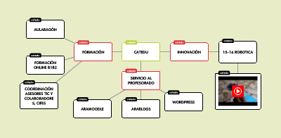

# Mapa mental

## ¿Qué es?

## ¿Qué herramientas hay?

Hay muchísimas como gustos: [Popplet](http://popplet.com/) , [Spicesnode](http://www.spicynodes.org/), [mind42](http://mind42.com/), [mindomo](https://www.mindomo.com/es/) (gratis sólo hasta 3 mapas).  ([Ver artículos JR Olalla](http://jr2punto0.blogspot.com.es/search/label/mapas%20conceptuales)). ¿Cual recomendamos? Spicesnote es nuestra favorita

Más abajo puedes ver cómo quedan embebidos las siguientes herramientas;  

## Ojo que es un flash

¿y qué? te preguntarás, pues que últimamente los flash tienen mala reputación por los problemas de seguridad, por lo que los navegadores, y ciertos alojadores están empezando a bloquearlos, por ejemplo si haces el blog en wordpress.com no deja embeberlo.

## ¿Entonces qué hago si no puedo embeberlo?

Puedes descargártelo como imagen, y ponerlo en el artículo y por supuesto poner también un vínculo. Abajo tienes ejemplos no embebidos de las mismas herramientas.

Si vas a trabajar sin embeber, una opción es utilizar [http://drichard.org/mindmaps/](http://drichard.org/mindmaps/) que **sin necesidad de registrar**, puedes crear tus mapas mentales, y permite grabarlos en formato imágen, y por lo tanto ponerlos en tu blog.

Hay también herramientas no on-line, sino programas que se instalan, y que por lo tanto descargas el mapa conceptual en forma de imagen y lo pones en el blog, por ejemplo [Freemind](http://freemind.sourceforge.net/wiki/index.php/Main_Page) y [CMapTools](http://cmap.ihmc.us/) 

## 

## ¿Cómo queda embebido SpicesNode?

<object type="application/x-shockwave-flash" data="http://media.spicynodes.org/display.swf?id=1063dae41faf762d665f89c47fe64352" id="spicynodesViewer" width="400" height="200"><param name="scalemode" value="showall"></param><param name="allowFullScreen" value="true"></param><param name="wmode" value="opaque"></param><param name="quality" value="high"></param><param name="allowScriptAccess" value="always"></param><param name="src" value="http://media.spicynodes.org/display.swf?id=1063dae41faf762d665f89c47fe64352"></param><param name="allowfullscreen" value="true"></param><param name="allowscriptaccess" value="always"></param><param name="pluginspage" value="http://www.macromedia.com/go/getflashplayer"></param></object>

## ¿Cómo queda sin embeber SpicesNode?

Sin embeber, no hemos encontrado exportar como imagen, habría que hacer una captura de pantalla:

Enlace: [http://www.spicynodes.org/a/1063dae41faf762d665f89c47fe64352](http://www.spicynodes.org/a/1063dae41faf762d665f89c47fe64352)

## ¿Cómo se hace?

Manuales hay muchos:

**SpicesNode**

- [Tutorial para aprender a usar Spicynodes](http://www.slideboom.com/presentations/136537), de Viviana Araya0
- [Spicynodes, un organizador gráfico interactivo](http://www.slideshare.net/santiav/spicynodes-5874559)

**Popplet**: manual [http://recursostic.educacion.es/observatorio/web/gl/internet/aplicaciones-web/1029-popplet](http://recursostic.educacion.es/observatorio/web/gl/internet/aplicaciones-web/1029-popplet)

[fuente [http://www.xarxatic.com/herramientas-2-0/mapas-y-diagramas/](http://www.xarxatic.com/herramientas-2-0/mapas-y-diagramas/)]

**Bubbl.us **

- [Manual de Bubbl.us](http://www.google.es/url?sa=t&amp;source=web&amp;cd=1&amp;ved=0CBgQFjAA&amp;url=http%3A%2F%2Fwww.juntadeandalucia.es%2Faverroes%2Fcentros-tic%2F11007922%2Fhelvia%2Fsitio%2Fupload%2FmanualBubblus_1.pdf&amp;rct=j&amp;q=manual%20bubbl.us&amp;ei=tUIZTuqdFIuMswa15LHADw&amp;usg=AFQjCNFVzNY9OA11VeJxmZB1XvS7__FRRQ&amp;cad=rja), de la Junta de Andalucía
- [Videotutorial de Bubbl.us](http://webs.ono.com/tomas.seneca/bubbl/bubbl.html), de Tomás Mata

**Mind42**

- [Cómo crear una cuenta en Mind42](http://www.slideshare.net/ZeroDark/manual-de-min42), de ZeroDark
- [Manual de Mind42](http://es.scribd.com/doc/30862212/Manual-Mind42), de María José Ciudad
- [Tutorial de Mind42](http://es.calameo.com/read/0005765212f065a90f10a), de Jhon Jairo Zapata

**FeeMind**

- [Aprovechamiento pedagógico del software FreeMind](http://www.slideshare.net/edu140271/tutorial-freemind), por Edu Valle
- [Tutorial de FreeMind](http://teleformacion.carm.es/moodle/mod/resource/view.php?id=55691), de la Consejería de Educación de Murcia

**CMapTools**

- [Tutorial de Cmap Tools](http://www.google.es/url?sa=t&amp;source=web&amp;cd=1&amp;sqi=2&amp;ved=0CCEQFjAA&amp;url=http%3A%2F%2Fwww.iered.org%2Fcmapserver%2Fservlet%2FSBReadResourceServlet%3Frid%3D1239999961281_1603882765_101253&amp;rct=j&amp;q=cmaptools%20tutorial&amp;ei=7e40TvqwCoXm-gbX2-yTDQ&amp;usg=AFQjCNFeXUebgSZc7zvEcPV724Dj48AMzA&amp;cad=rja), de Francesc Pastor (Universidad de Alicante)
- [Edición de mapas conceptuales: Cmap Tools](http://es.scribd.com/doc/2465505/Edicion-de-mapas-conceptuales-Cmap-Tools), de Aido Velásquez
- [Tutorial de Cmap Tools](http://issuu.com/colegio776/docs/tutorialcmaptools), de Renato Caporale

## ¿Cómo queda embebido Popplet?

<object type="application/x-shockwave-flash" data="http://popplet.com/app/Popplet_Alpha.swf?page_id=3106851&amp;em=1" width="460" height="460"><param name="allowFullScreen" value="true"></param><param name="allowscriptaccess" value="always"></param><param name="src" value="http://popplet.com/app/Popplet_Alpha.swf?page_id=3106851&amp;em=1"></param><param name="allowfullscreen" value="false"></param></object>

Si te fijas, con esta herramienta podemos poner **vídeos**, o de Youtuve o de Vimeo

## ¿Cómo queda sin embeber Popplet?

Pues exportándolo como imagen, y se coloca en el artículo con un enlace

Imagen:

Enlace: [http://popplet.com/app/#/3106851](http://popplet.com/app/#/3106851)

## ¿Cómo se hace en Popplet?

Por ejemplo en **Popplet**: se obtiene el código embed así

.png)

## ¿Cómo queda embebido en Mind42?

<iframe width="640" height="480" frameborder="0" src="http://mind42.com/mindmap/56f17e1d-5ac0-4430-8d0d-0cbad7964cd1?rel=embed"></iframe>

## ¿Cómo queda sin embeber Mind42?

Imagen

Enlace: [http://mind42.com/public/56f17e1d-5ac0-4430-8d0d-0cbad7964cd1](http://mind42.com/public/56f17e1d-5ac0-4430-8d0d-0cbad7964cd1)

## Sin embeber, Drichard.org

