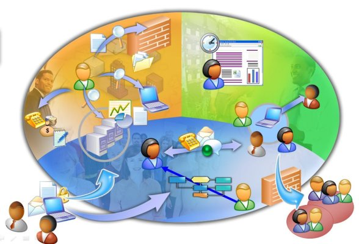

# Modo de participación

|Fig. 4.3 Fuente:[http://blogs.educared.org/red-pronino/g3proyectocolaborativomarzo2012/page/4/](http://blogs.educared.org/red-pronino/g3proyectocolaborativomarzo2012/page/4/)

&nbsp;

Los tipos de actividad colaborativa que podemos organizar o encontrar pueden ser muy diversos y por ello, en cada uno, la actividad a realizar puede diferir radicalmente.

- Se puede centrar en el trabajo de aula y la elaboración de materiales que luego se presentan o ponen en com&uacute;n con los demás participantes mediante un blog (por ejemplo), con lo que los medios de comunicación son un mero elemento transmisor.[Ejemplo](http://volmagma.blogspot.com.es/)
- También pueden tener a los medios de comunicación como elemento central de la actividad y desarrollarse mediante &nbsp;Foro, Correo, Videoconferencia... Eso supone que el tipo de trabajo y sus implicaciones en la organización espacio-temporal del aula va a ser muy distinta y habrá que tenerlos en cuenta de forma muy clara.[Ejemplo](http://pasapalabras.webnode.es/)

&nbsp;

Trabajando con cualquiera de esta tipología de actividades, los beneficios para el aula, son evidentes.Las ventajas son claras:

- Eficiencia: la comunicación es muy importante. Debemos delimitar la asignación de tareas.

- Mejora el clima del aula, fomentando valores tan importantes como la solidaridad o cooperación.

- Los refuerzos positivos entre iguales y la retroalimentación son dos potentes herramientas en el aula colaborativa.

&nbsp;

&nbsp;

