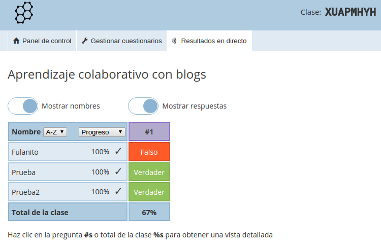

# Otros no integrados en el blog (fuera del curso)

Las anteriores herramientas : Drive, tus encuestas.com integraban la encuesta dentro del blog.

Hay otras herramientas para hacer preguntas pero que no permiten el embebido. ¿entonces para qué sirven en un blog?

- Para facilitar a los alumnos un enlace para que entren
- Se puede publicar los resultados, haciendo una captura de pantalla y queda en el artículo

Son herramientas pensadas para hacer encuestas en directo, no via blog, luego **QUEDAN FUERA DEL CURSO** sólo lo mostramos como ampliación de contenidos.

## Socrative

Es una página muy sencilla, te registras, y creas las preguntas, una vez creadas, te facilita un código donde el alumno cuando entra en [Socrative](http://www.socrative.com/) pide el código

Ejemplo En el blog pondríamos Entra en este enlace [https://b.socrative.com/login/student/](https://b.socrative.com/login/student/) y pon el código XUAPMHYH (puedes hacerlo si te apetece)

Cuando finalicen la encuesta, entras como profesor, y haces una captura de pantalla de los resultados:

Inconveniente: NO SE ACTUALIZA, porque no está embebido, lo anterior es una imagen, una captura, si has hecho la encuesta, no sale tu resultado.

Lo mejor es NO UTILIZAR EL BLOG, directamente se proyecta la pantalla anterior de Socrative, los alumnos entran en Socrative, y como está proyectado el código, hacen la encuesta en directo.

## Kahoot

Es similar al anterior, especializado más si se usa con tabletas, pues su app es muy interactiva y visual, aunque también se puede por web, su objetivo es más la gamificación (aprender jugando)

https//www.youtube.com/watch?v=aM3HRkUW_YA
