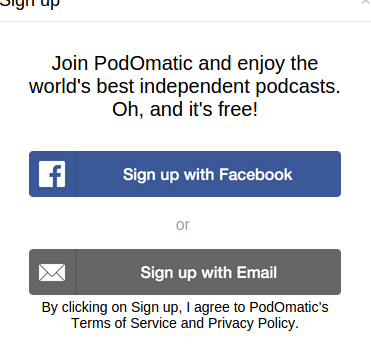
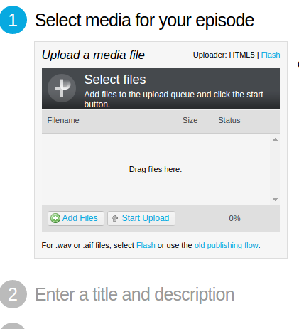
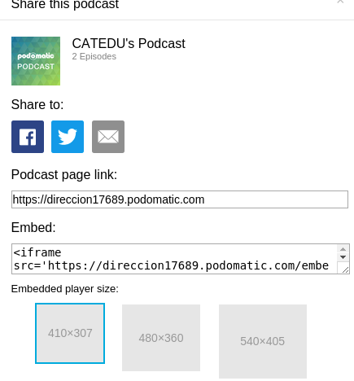

# Podcast

## ¿Qué es?

Aunque la definición técnica la puedes ver en la [Wikipedia](https://es.wikipedia.org/wiki/Podcasting), te lo podemos resumir como la posibilidad de subir tus audios en tu blog, de esta manera puedes tener una radio a la carta, subir tus audiciones de música, ejercicios de idiomas, entrevistas.... 

## ¿Con qué herramientas?

Hay muchas (Ivoox [tutorial](http://www.educacontic.es/blog/ivoox-la-letra-con-audio-entra) y [otras muchas](http://jr2punto0.blogspot.com.es/search/label/podcast) como por ejemplo [Audioboo y AudioPal](http://www.xarxatic.com/herramientas-2-0/sonido/)) pero la que te recomendamos es [Podomatic](http://jr2punto0.blogspot.com.es/search/label/podcast).p

## ¿Cómo queda?

Aquí tienes un ejemplo:

<iframe width="410" height="307" src="https://direccion17689.podomatic.com/embed/frame/multi/0?json_url=https%3A%2F%2Fdireccion17689.podomatic.com%2Fembed%2Fmulti%2F0%3Fcolor%3D43bee7%26autoPlay%3Dfalse%26facebook%3Dtrue%26height%3D307%26width%3D410%26minicast%3Dfalse%26objembed%3D0&amp;notb=1" frameborder="0" marginheight="0" marginwidth="0" scrolling="no" allowfullscreen=""></iframe>

## ¿Cómo se hace?

* Nos registramos en Sign Up

* Nos podemos registrar por Facebook o por correo electrónico, nosotros recomendamos correo electrónico

* Una vez registrado, entramos en Create Podcast

* Y vemos esta web para subir el archivo de audio

* Subimos el archivo de audio (Hay que usar un programa de grabación, recomendamos AUDACITY)

* Una vez subido, (nos insistirá que nos inscribamos a la cuenta no gratuita) podemos encontrar el código embed aquí:

