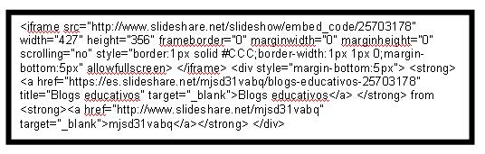
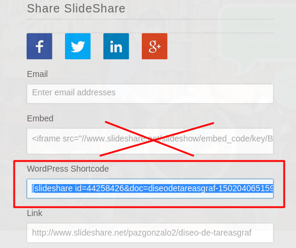

# Presentaciones

## **¿Cómo ponemos presentaciones en nuestro blog?**

Hay dos posibilidades:

* **Opción A:** Tenemos la presentación hecha (con Power Point, Impress..), y necesitamos un portal para colgar la presentación y embeberla en nuestro blog: 
    * Hay numerosos portales: por ejemplo [Slideshare](http://es.slideshare.net/)
    * En **Google Drive** podemos subir nuestra presentación


* **Opción B**: No tenemos la presentación queremos una herramienta Online para hacer nuestra presentación y a la vez que nos permita embeberla en nuestro blog: 
    * Una presentación hecha en **Google Drive**
    * Portales donde las presentaciones quedan muy llamativas. [Emaze](https://www.emaze.com/es/) ([tutorial](http://wp.catedu.es/lanuzadigital/creacion/presentaciones/emaze/)), [Slides](https://slides.com/), [Prezzi](https://prezi.com/) ([tutorial](http://recursostic.educacion.es/observatorio/web/gl/internet/recursos-online/970-prezi)) o [Genial.ly](https://www.genial.ly/es) ([tutorial](http://wp.catedu.es/lanuzadigital/creacion/presentaciones/genially/)). 

##Presentación Google Drive (recomendado)

Si hemos realizado una presentación online en Drive, lo podemos incrustar (embeber), dando a Publicar:


Y luego en **Insertar** - **Publicar** y nos enseña el código incrustado (embed) para ponerlo en nuestro artículo _(antes pide una confirmación si estamos seguros pues la presentación queda totalmente visible al público)_.


Aquí tienes cómo queda:

<iframe src="https://docs.google.com/presentation/d/e/2PACX-1vSvFa7L7i2sjaZZetRXJCFBiscv7d-p3cm5eR0D-6DeZ7I8icCvzG2SR4qEQ8tL_5wjJxwMczqJ9ZEk/embed?start=false&loop=false&delayms=3000" frameborder="0" width="960" height="569" allowfullscreen="true" mozallowfullscreen="true" webkitallowfullscreen="true"></iframe>

## **Slideshare** 

Es un portal de **presentaciones**. 

Igual que si tenemos un vídeo, lo podemos subir en Youtube para compartirlo. Pues si tenemos una presentación podemos utilizar el portal Slideshare para subir nuestra presentación y compartirla.

Otra herramienta es Prezi que permite hacer una presentación Online y además [permite incrustarla](https://docente2punto0.blogspot.com/2018/07/como-insertar-tu-prezi-next-en-un-blog.html).

El mecanismo es análogo En [esta página](http://es.slideshare.net/anarh/insertar-presentaciones-de-slideshare-en-nuestro-blog-28462888) enseña como incluir presentaciones de slideshare.

También dispones de estos manuales y tutoriales:

- [**Manual de utilización de Paloma Román Gómez**](http://www.slideshare.net/geopaloma/manual-de-utilizacin-de-slideshare)
- [**Tutorial de Educar(Karina Crespo)**](http://www.slideshare.net/lalunaesmilugar/tutorial-de-slideshare)
- [**Manual de uso, ubicado en facilytic, por Cesar Martínez**](http://www.catedu.es/facilytic/2013/10/09/comparte-tus-presentaciones-en-internet-con-slideshare/)
- [Blogs educativos](https://es.slideshare.net/mjsd31vabq/blogs-educativos-25703178) from **[mjsd31vabq](http://www.slideshare.net/mjsd31vabq)**[ ](http://www.slideshare.net/mjsd31vabq)

Aquí tenéis un ejemplo de código embebido desde Slideshare:



Para insertarlo, aquí tienes estos enlaces:

[Para Wordpress](http://www.donostik.com/2010/11/11/slide-share/)

[Para Blogger](http://www.ite.educacion.es/formacion/materiales/155/cd/modulo_2_imagen_digital_II/publicar_un_slideshare_en_blogger.html)

## Ojo con WordPress

Tenemos que utilizar, no el código embed normal, sino el específico:



## Ejemplo de la  con Emaze

Clica [aquí](https://app.emaze.com/@AFFWTLZW/mbot-kit-robotica-educativa-catedu). El código embebido funcionará en tu blog. En este libro no se incluye porque da problemas al exportar a pdf.

```html
<iframe src="https://app.emaze.com/@AFFWTLZW/mbot-kit-robotica-educativa-catedu" width="100%" height="540px" seamless webkitallowfullscreen mozallowfullscreen allowfullscreen></iframe>
```