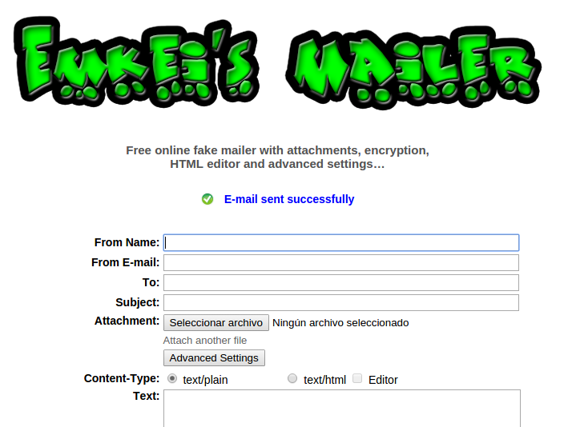

# Profesor&lt;-Alumno

Para hacer una actividad colaborativa con archivos, el envío de archivos de alumno a profesor es más difícil, hay varias opciones:

_(Hablamos siempre fuera de la red local, si es dentro de la red local hay opciones como compartir carpetas, o [Intranet]_(http://catedu.es/intranetypupitre/))

* Que el alumno o el grupo envíe el archivo** en un correo electrónico**
    - Desventajas: Hasta los 14 años no se puede tener correo electrónico [[ver](https://support.google.com/accounts/answer/1350409?hl=es)].
    - Solución: Utilizar [Google Apps for Education](https://www.google.com/edu/) donde el centro a través de un dominio, tiene cuentas para todos los alumnos y su control. Esto no se explicará en este curso pues se escapa de nuestros objetivos. En Aularagón (A partir de Oct-16) hay un curso sobre esta herramienta.
* Un truco es hacerlo al revés: Dar al alumno **usuario de editor**, y que él pueda crear una entrada, y por lo tanto colgar el archivo que quiera, como vimos en A través del artículo, el mejor es WordPress pero para dar de alta un usuario, necesita un email, y tenemos el problema anterior.
* Que tengas un enlace a un **formulario enlazado** a tu Dropbox de tal manera que una persona de forma anónima puede enviar archivos a esa carpeta.
* Que el alumno te envíe un archivo utilizando alguna página de **envío on-line de correo electrónico anónimo**.

No obstante, si las actividades que quieres realizar, normalmente es el envío de archivos, lo recomendable es que no uses Blog (platafora CMS, ver Módulo 1) sino una plataforma LMS como Moodle, donde los alumnos hacen entregas, y además los evalúas. Hay en Aularagón un curso de Moodle.

Vamos a ver las dos últimas opciones:

## Formulario enlazado a tu Dropbox

Existe un método (avanzado pero muy útil) de poner en el artículo un formulario y el alumno puede enviar archivos y otra información como si fuera un correo electrónico. 

* **Ventajas**. 
    - El envío se realiza diréctamente a tu Dropbox, lo único que tienes que hacer es abrir la carpeta correspondiente y ver los archivos, no es necesario hacer otra operación.

* **Desventajas**
    - Hay que utilizar **Dropbox** y **Jotform**, dos herramientas, por lo tanto no es inmediato.

### mmm.. interesante ¿Cómo queda eso?

Pues aquí tienes una prueba, si te apetece enviarme un fichero, fíjate que me lo puedes enviar si necesidad de correos electrónicos:

**¿Cómo se hace?** pues [entra aquí y verás paso a paso cómo se hace](http://javierquintana.ftp.catedu.es/TIC/TEMATICOS/Dropbox/recibir.html)

## Envíos online de correo anónimo

Existen numerosas páginas donde una persona puede enviar un correo electrónico sin necesidad de tenerlo

- **Ventajas**: Los alumnos sin necesidad de tener correo electrónico, pueden enviarte un email y adjuntar un archivo
<li>**Deventajas**:
<ul>
- Necesitan tu dirección de correo electrónico : Solución: Crea una que no sea la tuya personal.
- Seguramente tu correo electrónico clasifica como Spam los correos enviados de estas páginas. Solución: Desclasifícalo como Spam o consulta estos emails en la carpeta de Spam.

En [https://emkei.cz/](https://emkei.cz/) se pueden enviar emails adjuntando archivos. Luego en el artículo del blog habría que poner algo así:"Envía el archivo desde [https://emkei.cz/](https://emkei.cz/) a este correo electrónico miprofesor

