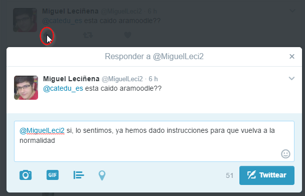
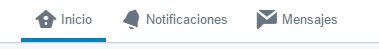

# Responde

_Twitter.png)

Cuando en un mensaje pulsamos al icono de responder, se añade automáticamente una mención al usuario, @usuario, luego....

** **responder no es más que un mensaje con una mención al usuario que se responde****

y el mensaje se convierte en una conversación pública

Si quieres que la conversación sea** privada**, son **mensajes directos**, y es necesario que la otra persona también nos siga, luego en el botón mensajes, sólo lo podemos hacer a nuestros seguidores: es el icono de Mensajes

