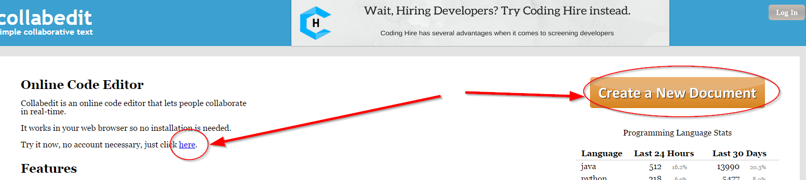

# Texto colaborativo

Antes existía TITANPAD que permitía crear documentos colaborativos sin necesitad de registro. Pero cerró en diciembre 2017.

Existen alternativas como MEETINGWORDS y COLLABEDIT su funcionamiento es igual que en **titanpad**, pero cambiando el nombre por los anteriores  [pequeño tutorial en esta página](http://aularagon.catedu.es/materialesaularagon2013/blogs/videos/titanpad.htm) (Flash SWF) [ otra en formato PDF](http://aularagon.catedu.es/materialesaularagon2013/blogs/videos/Titanpad.pdf)

## [Meetingwords](http://meetingwords.com/)

ES EXACTAMENT IGUAL QUE TITANPAD: Entramos en [http://meetingwords.com/](http://meetingwords.com/) y creamos un documento SIN NECESIDAD DE REGISTRO en el blog ponemos simplemente el enlace no se puede embeber

Un ejemplo aquí [http://meetingwords.com/KH3UxPB1aj](http://meetingwords.com/KH3UxPB1aj)[](http://meetingwords.com/KH3UxPB1aj)

## [Collabedit](http://collabedit.com/)

Igualmente en esta página, entramos y pinchamos en crear documento, curiosamente tiene dos sitios para hacerlo también SIN NECESIDAD DE REGISTRO



Un ejemplo aquí [http://collabedit.com/urn3r](http://collabedit.com/urn3r) pero no se puede embeber igual que antes


## Cómo incrustarlo (embeberlo)...


%accordion%Solución%accordion%

Utilizando la etiqueta *```<iframe>```* puedes embeber cualquier **Sitio web externo** estático, es decir no interactivo. Por ejemplo, el código utilizado para embeber *¿Como queda en MeetingWords?* es:

```html
<iframe src="http://meetingwords.com/KH3UxPB1aj" frameborder="0" width="100%" height="700" allowfullscreen="true" mozallowfullscreen="true" webkitallowfullscreen="true"></iframe><iframe src="http://meetingwords.com/KH3UxPB1aj" frameborder="0" width="100%" height="700" allowfullscreen="true" mozallowfullscreen="true" webkitallowfullscreen="true"></iframe>
```

%/accordion%
