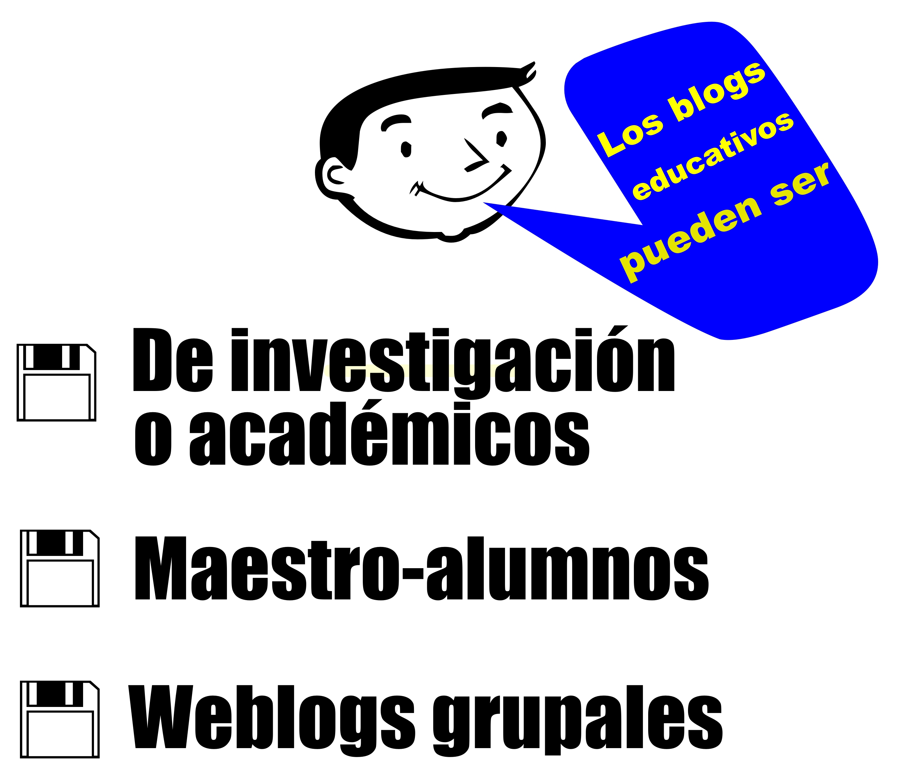

# Tipos de blogs

No pretendemos, ni perseguimos establecer una taxonomía de las distintas bitácoras o blogs que se pueden perfilar en el ámbito educativo pues, seguramente podremos hacer tantas como intenciones educativas haya o como objetivos curriculares específicos se planteen.

**Fernando Santamaría González** hace una síntesis de las clasificaciones de varios autores, especialistas en este asunto que han estudiado el tema (**Tíscar Lara**, Lorenzo García Aretio y J. Carrera Plaza) y establece la siguiente clasificación:

**Blogs académicos o de investigación:** Este sector agrupa las bitácoras de investigación de distintos departamentos, con líneas de estudio, proyectos y perspectivas de desarrollo. _También los blogs de docencia, entre educadores, que permiten debatir y compartir experiencias en su área a profesores de distintos centros_. _**Sería interesante tener bitácoras de los profesores sobre sus modelos de formación y su metodología didáctica**_.

Estos blogs sirven a su vez de acicate para **la colaboración entre distintos centros, **para **elaborar el material curricular**, aunque en estos casos quizá se use más el correo electrónico. Un ejemplo de este tipo de blogs es el portal de _Aulablog_

**Blogs de profesor-alumnos:** Son, tal vez, los que más nos interesan. Tienen también muchas modalidades y formas de usarlos. Una de las más utilizadas es para dirigir el proceso de aprendizaje. En ellos se publican aspectos formales que tengan que ver con la materia o asignatura a impartir. El profesor, de manera sencilla, puede incluir trabajos a realizar, proponer temas a desarrollar, apuntes (a desarrollar o incompletos), actividades a realizar (como **webquest**), enlaces de interés para ampliar la formación, orientaciones de estudio, etc. El **edublog** debería ser abierto a debates y comentarios por parte de los alumnos. De este modo el profesor puede recibir esa información como **feedback**, lo que le puede hacer replantear el currículo de la asignatura.

**Weblogs grupales o alumno-alumno**: En ellos la interrelación entre alumno-alumno y profesor se puede orientar de muchas maneras, pero nos centramos en algunas de las características que implican esta estructura metodológica: 

- Son un método de trabajo colaborativo y de trabajo en grupo.
- Generan una estructura horizontal (varias bitácoras al unísono) para debatir, analizar y conjugar diferentes experiencias de producción y distribución de contenidos.
- Incentivan y activan la participación y el debate entre los propios alumnos.

_“Los alumnos de la asignatura desarrollan sus propias bitácoras de clase, utilizándolas como medio de comunicación con los profesores, y como plataforma de publicación de los ejercicios del curso. Asimismo, cada alumno crea y mantiene una bitácora personal sobre un tema de su interés, que se dirige y evalúa como un proyecto final.”_ Orihuela y Santos, 2004).

_Ferrer Soria, G. y Martínez Bel A._ proponen una sencilla clasificación según sean Blogs individuales o colectivos:

* **Blogs Individuales**: En este sector se encuentran tanto los blogs personales (libres) como los _profesionales_.
* **Del profesor**: De entre éstos nos interesan aquellos que hacen referencia al **Intercambio de experiencias didácticas y metodológicas entre docentes; dirigidos a alumnos de su tutoría** (blog del tutor), **área o materia** (Blog de la asignatura).

_L. García Areitio (2005)_ estructura estos tipos de blogs en aquellos que:

- Ofrecer orientaciones y facilitar materiales electrónicos propios o vínculos de la propia red.
- Proponen debates sobre algunos de los puntos relevantes del tema que se esté tratando o sobre cuestiones nuevas no tratadas en los temas del programa, aunque sí relacionadas con ellos. 

o **Dirigidos a la Comunidad educativa **de modo que proporcionan información periódica y relevante a las familias sobre la evolución general del aula o grupo en cuestión. A su vez facilita el intercambio de opiniones e informaciones entre todos los miembros.

Un [ejemplo](http://www.catedu.es/arablogs/blog.php?id_blog=2143) de este tipo de blogs lo podemos encontrar en este caso es un blog de Ed. primaria utilizado entre otras cosas, **COMO INSTRUMENTO PARA OPTIMIZAR LAS RELACIONES ENTRE LOS MIEMBROS DE LA COMUNIDAD EDUCATIVA **En este caso, extrapolable a otras situaciones, etapas, materias, etc.

 

Los blogs sirven como lugar de exposición de lo que se va trabajando, instrumento de comunicación con las familias y lugar donde se ponen enlaces y materiales de interés. También, por supuesto, sirven de instrumento de motivación para las niñas y niños y para que las familias aumenten su motivación por la vida escolar de sus hijos. Un ejemplo puede ser el blog de **José Alonso** del CEIP Rosales del Canal - Zaragoza.

 

<li>**De los alumnos: **En este sector se encuentran tanto los blogs personales (libres) como los **de aprendizaje**. De entre éstos, y siguiendo a **García Areitio (2005)**, nos interesan aquellos cuya intencionalidad didáctica es: 
<ul>
- La resolución de situaciones de aprendizaje planteadas por el profesor.
- El desarrollo de trabajos colaborativos en pequeños grupos.

Sin olvidarnos de aquellos que están orientados al

* ** [Diario de autoaprendizaje](http://cedec.intef.es/los-diarios-de-aprendizaje-una-herramienta-para-reflexionar-sobre-el-propio-aprendizaje/)**
* **Expresión libre: oral ([podscats](http://recursostic.educacion.es/blogs/malted/index.php/2012/02/16/podcasts-en-el-aula)), escrita, o audiovisual**
* ** [Diarios de investigación personal ](http://1bathmc201516.blogspot.com/)**

## Blogs colectivos

Ya hemos avanzado algo de esto en las líneas anteriores. La intencionalidad queda aquí, determinada por la finalidad de los mismos y la elaboración y participación de amplios sectores: **Blogs de centro, intercentros, CRAS, etapa, departamento, ciclo.**

En todos ellos generalmente las intencionalidades van dirigidas a:

- Servir como lugar de exposición de lo que se va trabajando
- Ser instrumento de comunicación con las familias**.**
- Proponer y recoger los resultados de las actividades y proyectos de colaboración realizados por grupos de alumnos de distintos centros, niveles o etapas.
- Actúan de diario o registro de la actividad realizada en el colectivo que se responsabiliza del blog.

 

