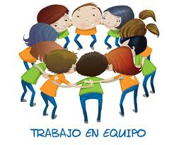

# Trabajo en equipo y roles

<td style="text-align: center;">Fig. 4.6 Fuente.[http://liredazgo.blogspot.com.es/2011/01/equipo-de-trabajo-y-trabajo-en-equipo.html](http://liredazgo.blogspot.com.es/2011/01/equipo-de-trabajo-y-trabajo-en-equipo.html)</td>

&nbsp;

Una vez realizada la distribución, es importante que se realice un reparto adecuado de tareas y funciones, lo que normalmente lleva aparejado una distribución de roles. **Esa distribución se ha de hacer sin que exista carácter jerárquico ni compartimentos de trabajo estancos para evitar caer en la separación que dificulte la colaboración**, más bien de ha de hacerse con miras a responsabilizar a los alumnos de la consecución de los objetivos parciales y de la necesaria coordinación en diferentes tareas.

Estaremos reforzando la interdependencia, la responsabilidad personal y se habrá de poner en juego las estrategias de trabajo colaborativo. Aquí es dónde más riesgo se corre de convertir el trabajo en &ldquo;cooperativo&rdquo;, lo cual tampoco sería una gran pérdida si funcionara adecuadamente. Por ello se pueden alternar los diferentes papeles en función de cada proyecto para que todos vayan realizando cada rol. Pero además de desempe&ntilde;ar el rol correspondiente,** &ldquo;han de hacer el trabajo&rdquo;**.

****Algunos de los roles que se pueden asignar son: ****

**Facilitador:** Puede ser el elemento del grupo encargado de asegurarse de que todos comprenden las tareas, los objetivos y los procesos a realizar. También puede asumir, si se considera adecuado, el papel de animador, procurando que al tiempo que ayuda a resolver las dudas anime y aliente a los componentes del grupo. No debe ocupar plaza de líder.

**Comunicador: **Es el miembro encargado de hacer de interlocutor con los informantes externos, el profesorado, otros compa&ntilde;eros de otros centros... al tiempo que presenta, comunica, envía o explica los trabajos realizados por el equipo.

**Encargado de materiales:** Se encarga de pedir, obtener y gestionar los materiales necesarios para la realización de las tareas y comprobar el correcto funcionamiento de los equipos así como solicitar ayuda cuando sea preciso.

**Secretario: **Es el encargado de recoger y reflejar los trabajos realizados y las conclusiones que alcanza el grupos y presentarlas con la colaboración del comunicador.

**Planificador:** Su responsabilidad es organizar las tareas con la finalidad de se cumplan los plazos previstos y en su caso sugerir apoyos dónde se vea necesario para equilibrar las tareas.

Queda a vuestro juicio establecer cuáles son los roles necesarios y aumentarlos o reducirlos o destinar más de un componentes a ellos. Más adelante se cita el rol de **Mediador** que, si se considera necesario, se puede establecer desde el inicio y de forma fija, pero es más delicado.

&nbsp;

