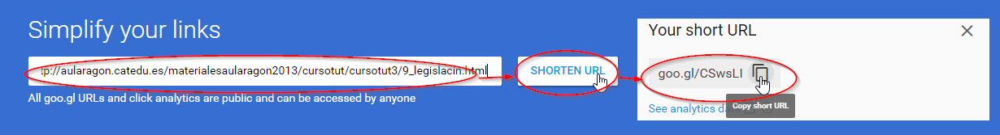

# Tweets

___Twitter.png)

## Enriquece tu Tweet con una imagen

A la hora de twittear podemos añadir una **imagen** (logotipo de la cámara) que además de llamar la atención de nuestro mensaje, lo representa o incluso puede ampliar su información sin necesidad de estar sujetos a los 140 caráctereres.

- En la figura se puede ver que en el tweet se ha añadido una imagen que es una captura en Word con el robot, y los contenidos.
- Al final del mensaje se puede ver cuanta gente a retwitteado y les ha gustado el mensaje.

___Twitter.png)

## Enriquece tu información con un enlace

También podemos poner una dirección URL para acceder más información, pero para no gastar los 140 caracteres, te recomendamos algún **acortador de URL** por ejemplo [https://goo.gl/](https://goo.gl/)

un ejemplo:

___Twitter.png)

