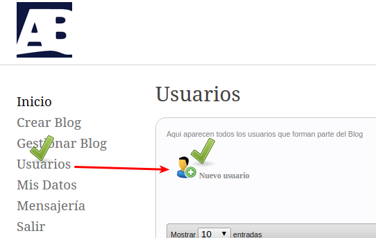
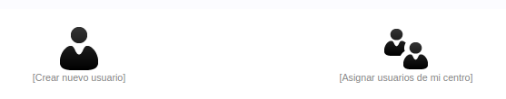
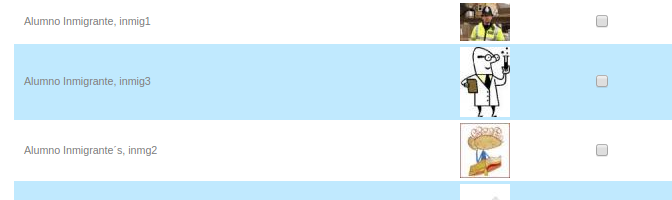
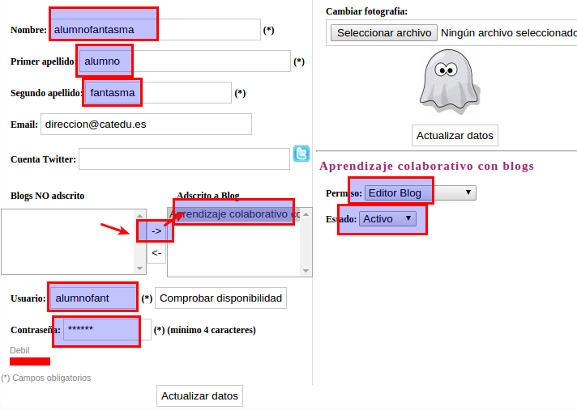

# U1.- Blogs de alumnos

Esta sí que es una buena opción colaborativa: Un blog donde los alumnos **escriben sus artículos, debaten, inquietudes, se expresan, trabajan sobre una materia!!**

## Mejor que rollos: ejemplos:

Fíjate en todos estos ejemplos, que los artículos NO ESTÁN ESCRITOS POR EL PROFESOR sino por los alumnos.

<li>**Blogs de Ed Infantil**
<ul>
- [Pequeños Alhameños](http://www.catedu.es/arablogs/blog.php?id_blog=152&amp;id_articulo=116340): Es un blog del CATEDU en el que los niños entran como usuarios de Ed. Infantil y pueden escribir sus propios artículos (después son transcritos por la maestra antes de su publicación). Se combinan los artículos escritos por los alumnos con otros publicados por los profesores.
- [Valde-bloggers](http://arablogs.catedu.es/blog.php?id_blog=2396) de Infantil, todo son trabajos y expresividad de los alumnos/as de **infantil**

- [Escribimos al mundo](http://arablogs.catedu.es/blog.php?id_blog=2502) de primaria, un portal donde los alumnos de primaria se expresan en forma de** noticias**
- [Pserikasaj](http://arablogs.catedu.es/blog.php?id_blog=2442) los alumnos/as se expresan** libremente**
- [Escribir es importante](http://www.catedu.es/arablogs/blog.php?id_blog=2060&amp;id_categoria=13307): Blog elaborado con las producciones literarias de los alumnos del CEIP Gascón y Marín (Zaragoza).
- [Taller de prensa: ](http://www.catedu.es/arablogs/blog.php?id_blog=1994) En este blog de los alumnos de 5º del CP Tio Jorge de Zaragoza. Los post están redactados por ellos y cuentan a modo de noticias las cosas importantes que hacen o suceden en el colegio.

- [En tiempos de mis bisabuelos](http://arablogs.catedu.es/blog.php?id_blog=2296) donde los alumnos de secundaria  convierten el blog en un** Trabajo de investigacion**
- [LA DECOUVERTE DU MONDE EN FRANÇAIS](http://arablogs.catedu.es/blog.php?id_blog=938) donde los alumnos escriben en una **lengua extranjera**
- [PROA IES Bajo Aragón](http://www.catedu.es/arablogs/blog.php?id_blog=2362&amp;pg=1) (Alcañiz): Blog en el que participan los alumnos del PROA escribiendo diferentes tipos de post en los que también incrustan presentaciones, vídeos,...
- [Lengua IES Joaquín Costa (Cariñena):  ](http://www.catedu.es/arablogs/blog.php?id_blog=2352)Blog aula para los alumnos de 4ª de la ESO en el que trabajan el área de lengua. Post con poesías, composiciones,... realizadas por ellos.

Blogs donde escribe el profesor pero de actividades colaborativas de los alumnos:

<li>**Blogs en Ed. Infantil:**
<ul>
- [La clase de Miren](http://laclasedemiren.blogspot.com.es/): Es un  blog de aula en el que la maestra va contando las cosas que suceden en clase.

- [CEIP Valdespartera](http://www.catedu.es/arablogs/blog.php?id_blog=1600): Este blog está elaborado por los profesores del centro, bajo la coordinación de uno de ellos (Daniel Martín) y en él se explica lo que se va trabajando en cada aula, se muestran fotos, se suben trabajos,... Es además, una importante fuente de buenos recursos clasificados y organizados por etapas y áreas, juegos, aplicaciones, etc.

## ¿Cómo hacerlo?

<li>**ARABLOGS** es la herramienta ideal, está diseñado para que el profesor (administrador que en este caso se llama** **moderador**)
<ul>
- PERMITE DAR DE ALTA USUARIOS - ALUMNOS SIN NECESIDAD DE EMAILS
- Existe la posibilidad de que los usuarios SEAN ALUMNOS DE INFANTIL con una interface adaptada a alumnos prelectores.
- ¿cómo se dan de altas usuarios?

# Con ARABLOGS

Entramos en el panel de Administracion de Arablogs ([aquí](javascript:MM_openBrWindow('admin/index.php','','location=no,scrollbars=yes,resizable=yes,width=1024,height=670')) con nuestro usuario y contraseña que nos ha facilitado CATEDU) y vamos a usuarios, nuevo usuario:

Tenemos dos opciones

Asignar los alumnos de nuestro centro que ya están registrados en arablogs (en otro blog)

O la otra opción, crear uno nuevo, y rellenamos los campos, obligatorios los marcados:

para más información  [mira la página 14 del manual](http://arablogs.catedu.es/portal/images/Pdf%20S.png)

