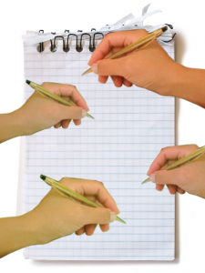

# U2.- Documentos

Aquí si que vamos a trabajar en Grupo: **en el mismo documento **OJO! la anterior unidad trabajaba 1-1 y al descargar, el usuario tiene una copia de lo que se descarga, el original no se toca, y un usuario no molesta a otro usuario, todo son copias.

## ¿Cómo que OJO?

Pues que uno puede fastidiar o borrar el trabajo de otro. 

## No nos alarmemos por esto

La experiencia que tenemos es que los compañeros son respetuosos unos con otros, (buena oportunidad para aprender el** respeto y trabajo en equipo**) rara vez un alumno estropea el documento, y si pasase esto, SIEMPRE SE PUEDE  VOLVER A LA VERSIÓN ADECUADA y tenemos el HISTORIAL para ver quien ha puesto qué cosa.

El historial puede además ser una buena herramienta para **evaluar la participación del alumno**, (Quién ha aportado más,cuánto tiempo, quién no ha participado, aportaciones, quién ha dejado comentarios...) [ver herramienta en Drive Revision History Analitics](http://villaves56.blogspot.com.es/2016/04/complemento-para-google-docs-revision.html#.VyB1MUyLSM8)

