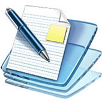

# U3.- Documentos

Seguimos con darle potencialidad a nuestro blog, en la anterior unidad hemos puesto elementos multimedia

Ahora le vamos a añadir elementos tipo ofimática, documentos, :

- Presentaciones
- Documentos texto
- Libros digitales
- Líneas de tiempo
- Mapas conceptuales o mentales

