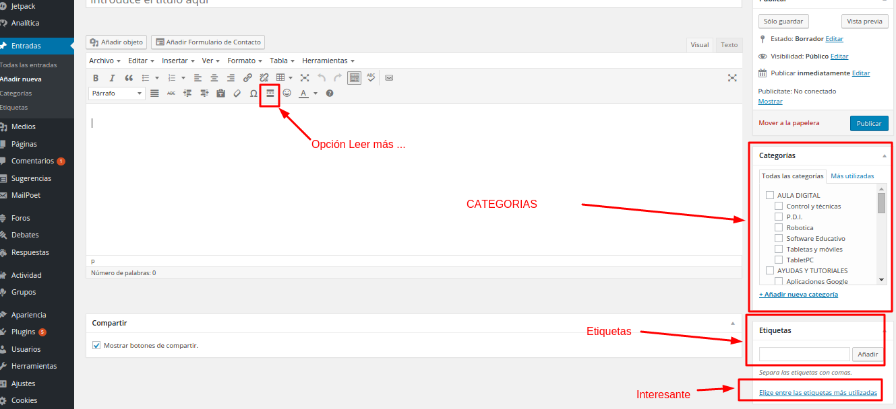

# WordPress

En [este enlace ](http://facilytic.catedu.es/wp-content/uploads/2013/04/Manual_WP_2.pdf)de la U2 ya vistes cómo se escriben artículos (aquí llamados Entradas), simplemente queremos que te fijes en los conceptos que estamos recalcando:

- Categorías
- Tags o palabras clave
- El cuerpo del artículo y el botón Leer más...

